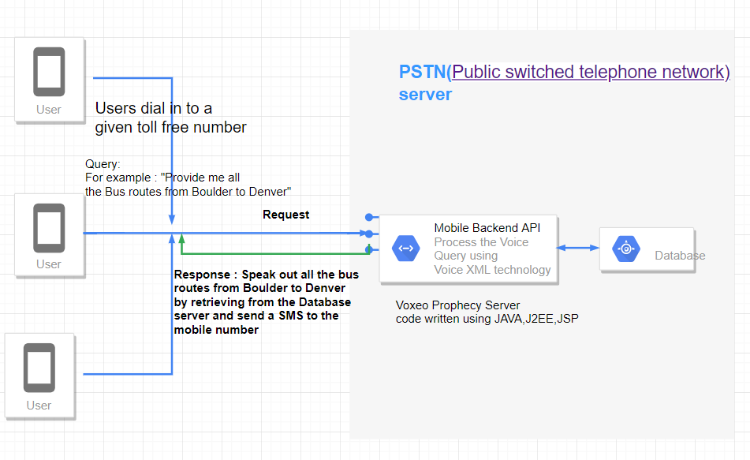
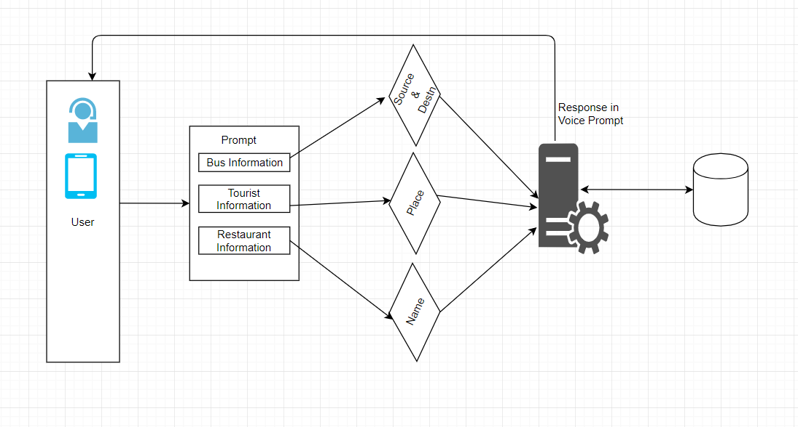
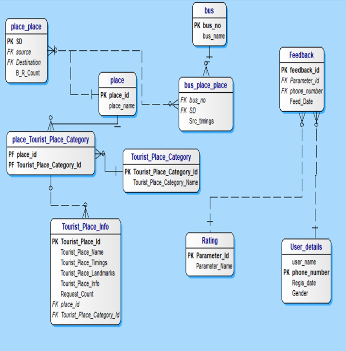
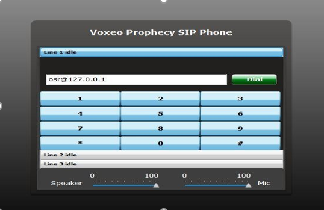
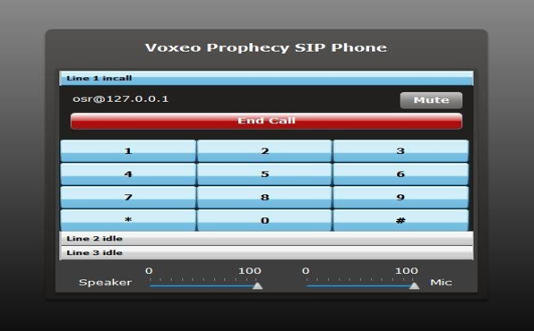

# CityGuide

## Goal:
The voice xml technology based application acts as a vanguard to the visitors as well as residents in the
Hyderabad city in finding various resources such as shuttle service, tourist attractions just by a phone call.

#### Complete Project Report is at .

## Introduction:
#### Overview:
The application acts as a vanguard or pathfinder to the pioneers as well as residents in the city in finding the exact bus service information to reach the destination or the tourist place. It congregates the required information and provides the exact bus service information to catch up. Thus, helps user in channelizing the path through the use of technology.
#### Existing System:
At present there is no technological solution through the use of mobile technology. The  solution exists through the use of internet which is less percolated  with access to 10.4% population  in India compared to tele-density which is of 74% .The use of internet is of much complex in nature compared to a mobile phone. Another way is to enquire the people around which has following disadvantages.
#### Disadvantages 
1.  Reliability of the information provided
2.  Appropriate timings and schedule
3.  Information provided can be limited
4.  Availability of the person and 
5.  Security may be also in trouble.
So, due to the above setbacks the use of existing systems is not recommended.
#### Proposed System:
In the proposed system the user dials up the given Phone number and provides the required information and acquires the required information to reach the destination. It has following advantages over the existing systems like

#### Advantages:
1.	It is more reliable
2.	Available by 24 by 7 
3.	Provides appropriate timings
4.	Access the required information of whole city
5.	Appropriate planning before leaving to destination 
6.	Access from any remote location.

## Architecture:
#### High Level Architecture:

#### Low Level Architecture:

#### Entity Relationship Diagram: 

## Results: 

## References:
Sagiroglu, S.; Sinanc, D. (20-24 May 2013),”City Guide”.  
Mukherjee, A.; Datta, J.; Jorapur, R.; Singhvi, R.; Haloi, S.; Akram, W. (18 -22 Dec. 2012) “City Guide”.  
Aditya B. Patel, Manashvi Birla, Ushma Nair (6-8 Dec. 2012) “City guide”.  
